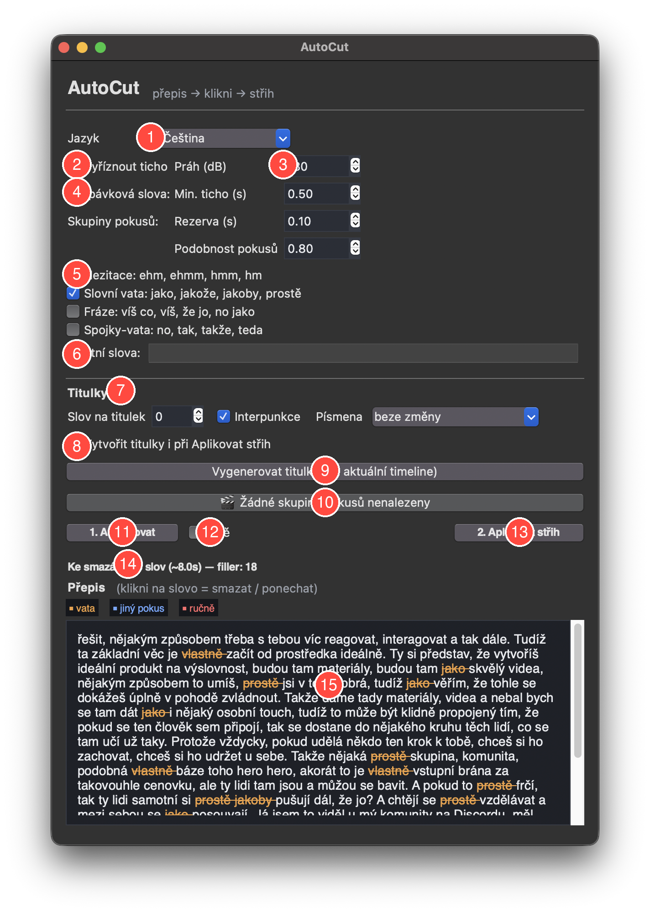

# Návod — AutoCut pro DaVinci Resolve

## Workflow v kostce

1. V Resolve otevři **původní** timeline (jeden dlouhý klip na V1).
2. **Workspace → Scripts → Utility → AutoCut Panel** otevře okno níže.
3. Nastav volby ⓵–⓼, klikni **1. Analyzovat** ⓫.
4. V přepisu ⓯ klikáním označuj/odznačuj slova; v ⓾ vyber nejlepší z opakovaných pokusů.
5. **2. Aplikovat střih** ⓭ vytvoří novou timeline `… - AutoCut` se střihem (a případně titulky).

## Co znamenají jednotlivá čísla

**① Jazyk** — jazyk, ve kterém mluvíš. Whisper podle něj přepíše a tvoří titulky. Čeština je výchozí.

**② Vyříznout ticho** — pokud je zaškrtnuté, ticha v audiu se při Aplikovat střih ořežou.

**③ Práh / Min. ticho / Rezerva** — citlivost detekce ticha:
- **Práh (dB)** — co je tišší než tento práh, se považuje za ticho (−30 dB je výchozí).
- **Min. ticho (s)** — kratší pauzy se nechávají být (jinak by se rozsekala přirozená kadence).
- **Rezerva (s)** — kolik vteřin dechu nechat kolem řeči, aby se neřezala slova.

**④ Vycpávková slova** — popisek sekce s vatou. Vata se filtruje, jakmile zaškrtneš aspoň jednu skupinu níže.

**⑤ Skupiny vaty** — předdefinované sady (hezitace `ehm/hmm…`, slovní vata `jako/prostě…`, fráze, spojky). Můžeš si je kombinovat.

**⑥ Vlastní slova** — vlastní seznam k vyříznutí, oddělený čárkou (`tudíž, fakt, no`). Funguje hned, bez nové analýzy.

**⑦ Titulky** — sekce s nastavením titulků:
- **Slov na titulek** — kolik slov na jednu titulkovou cue. `0` = bez limitu (jen délka řádku).
- **Interpunkce** — nechat/odstranit `. , ! ? …`
- **Písmena** — beze změny / První velké (věta) / VŠE VELKÝM / vše malé.

**⑧ Vytvořit titulky i při Aplikovat střih** — když je zaškrtnuté, společně se střihem se rovnou udělají i titulky (využije už hotový přepis, žádný druhý průchod whisperem).

**⑨ Vygenerovat titulky (na aktuální timeline)** — samostatné tlačítko: udělá titulky na timeline, kterou máš zrovna otevřenou. Pokud jsi analyzoval, použije ten přepis; jinak přepíše timeline znovu.

**⑩ Vybrat nejlepší pokus ze skupin** — Po analýze ukáže počet detekovaných skupin (`🎬 Vybrat nejlepší pokus (X skupin)`). Klikni → otevře se okno s pokusy v každé skupině; vybereš ten, co se ti povedl. Ostatní se v přepisu přeškrtnou modře a vystřihnou. Když není co vybrat, tlačítko se zakáže.

**⑪ 1. Analyzovat** — Spustí přepis whisperem. Trvá zhruba 1× délka audia (na M-series Macu). Během běhu se tlačítko přepne na **⏹ Zastavit** — lze přerušit.

**⑫ Živě** — Po každém kliknutí na slovo (smazat/vrátit) se nová ořezaná timeline automaticky přestaví v Resolve (s ~0,7 s prodlevou). Editing à la Descript.

**⑬ 2. Aplikovat střih** — Vytvoří novou timeline `<jméno> - AutoCut` se střihem podle tvého výběru. Původní timeline zůstává netknutá. Pokud máš ⑧ zaškrtnuté, dostanou se na ni i titulky.

**⑭ Status** — Ukazuje stav (Připraveno / Analyzuji / Aplikuji…), kolik slov je ke smazání a z jakých důvodů (filler/take/manual).

**⑮ Přepis (klikni na slovo)** — Editovatelný přepis aktuální timeline:
- 🟠 **vata** — automaticky navržená vycpávková slova
- 🔵 **jiný pokus** — neyzvolené pokusy ze skupin
- 🔴 **ručně** — slova, která jsi ručně přepnul

Klikni na **libovolné slovo** v přepisu → přepneš ho smazat/ponechat. Tvoje manuální volby přežijí změny filtrů.

## Tipy

- **Když chceš jen titulky, bez řezání**: otevři timeline, dej `Vygenerovat titulky` ⑨. Analyzovat ani Aplikovat nemusíš.
- **Když řežeš opakované pokusy**: otevři okno přes ⑩ a v každé skupině klikni na ten povedený. Ostatní zmizí.
- **Když ti algoritmus mazal „jako" tam, kde má smysl** (přirovnání): odškrtni *Slovní vata* a ponechej jen *Hezitace*. Případně klikni v přepisu na to konkrétní „jako" — ručně ho vrátíš.
- **Když ti vadí, že se Resolve mezi cuts „přepíná"**: vypni ⑫ Živě a stříhej až manuálně přes ⑬.
- **Když má kamarád taky Vowen**: instalátor automaticky najde model uvnitř Vowenu a nestahuje znova.

## Klávesové zkratky

Aktuálně žádné — vše se ovládá myší v okně. Tipy na zkratky uvítám!
